# 🎬 Superjoin Fact Knowledge Layer — 3-Minute Video Demo Script

> **Total Video Target Length:** 3:00 minutes (180 seconds)  
> **Resolution / Layout:** 1080p or 1440p (Full Desktop Screen)  
> **Interactive Helper:** Click the **`3-Min Master Tour`** button in the top navigation bar to launch the interactive live walkthrough in the UI, or hit **`Auto-Play (3m)`** to let the interface smoothly transition across each scene!

---

## ⏱️ Video Timestamp Breakdown

```mermaid
gantt
    title 3-Minute Master Product Demo Flow
    dateFormat X
    axisFormat %s s
    section Intro & Overview
    1. Executive Dashboard & Multi-Corporate Scope :0, 20
    section Grounded Storage
    2. Fact Explorer & Inverted Index Search       :20, 40
    3. Financial Spreadsheet & Cell-to-BBox Link   :40, 60
    section Forensic Reconciliation
    4. Note 34 Scope Perimeter Bridge (Ind AS 110) :60, 80
    5. Dual-Document Vector PDF Comparator         :80, 100
    6. Non-GAAP Metric & Prior-Period Revisions    :100, 120
    section Graph & Swarm AI
    7. Interactive D3 Knowledge Graph              :120, 140
    8. Autonomous Multi-Agent Swarm Cockpit        :140, 160
    section Compliance
    9. Certified Statutory Audit Dossier Export    :160, 180
```

---

## 🎙️ Scene-by-Scene Narration & Screen Action Script

---

### **Scene 1: Systemic Architecture & Multi-Entity Overview (0:00 – 0:20)**
- **Screen View:** `Dashboard` view with real-time Chart.js trends, multi-corporate workspace pills (Delhivery, Apple, Tesla, Amazon, India Macro).
- **On-Screen Action:** Click `Sync` on sidebar; highlight the live metric cards (9 Audited Filings, 746 Grounded Facts, 0.00% Unresolved Variance).
- **Voiceover Narration:**
  > *"Welcome to Superjoin Fact Knowledge Layer. When enterprises make high-stakes decisions from messy corporate filings—10-Ks, annual reports, and macro bulletins—numbers often contradict due to differing scopes, non-GAAP adjustments, and reporting periods. Superjoin solves this by grounding every number directly into source PDF pixels, building a mathematically reconciled knowledge graph with zero hallucination."*

---

### **Scene 2: Grounded Fact Explorer & Sub-Millisecond Search (0:20 – 0:40)**
- **Screen View:** `Fact Explorer` table with 50-item pagination and search bar.
- **On-Screen Action:** Type `"revenue"` into the debounced filter; click the **`Studio`** button on a fact row to open the Document Canvas modal.
- **Voiceover Narration:**
  > *"In our Fact Explorer, multi-attribute inverted hash indexing delivers sub-millisecond filtering across thousands of facts. Clicking 'Studio' instantly renders the source filing page at 150 DPI with glowing SVG bounding boxes anchored to the exact coordinates—giving auditors immediate pixel-level provenance."*

---

### **Scene 3: Interactive Superjoin Financial Spreadsheet Grid (0:40 – 1:00)**
- **Screen View:** `Financial Grid` tab showing the live spreadsheet model.
- **On-Screen Action:** Click cell **`B1 (Revenue ₹8,141.65 Cr)`** and cell **`B4 (Net Profit ₹-249.00 Cr)`**; observe the right-side Live Citation Dock updating dynamically.
- **Voiceover Narration:**
  > *"Next is our Superjoin Financial Spreadsheet Grid. It operates just like Excel with dynamic formula calculations, but every single cell is permanently tethered to its underlying PDF evidence. Selecting cell B1 immediately displays the exact filing snippet, confidence score, and one-click citation inspection."*

---

### **Scene 4: Forensic Anomaly Resolution — Note 34 Perimeter Bridge (1:00 – 1:20)**
- **Screen View:** `Financial Grid` -> `Note 34 Scope Bridge` tab.
- **On-Screen Action:** Highlight the waterfall bridge: Standalone (₹7,542.80 Cr) + Subsidiary Spoton Logistics (₹598.85 Cr) = Consolidated (₹8,141.65 Cr).
- **Voiceover Narration:**
  > *"Here is a classic corporate accounting contradiction: Delhivery's standalone revenue was ₹7,542 Cr, while consolidated was ₹8,141 Cr. Superjoin automatically parses Note 34 on Page 218 to isolate the ₹598 Cr subsidiary adjustment from Spoton Logistics, proving zero residual variance under Ind AS 110."*

---

### **Scene 5: Synchronized Dual-Document Evidence Comparator (1:20 – 1:40)**
- **Screen View:** `Dual Document Comparator` modal (`openCaseDualCanvas(1)`).
- **On-Screen Action:** Scroll and zoom side-by-side; point out the glowing bounding boxes on Standalone (Pg 218) vs Consolidated (Pg 185) and the `0.00% Variance` badge.
- **Voiceover Narration:**
  > *"Our Synchronized Dual-Document Comparator places both source PDF pages side-by-side using high-performance vector rendering. Auditors can zoom simultaneously, inspect glowing bounding boxes across two different filings, and verify forensic explanations in real-time."*

---

### **Scene 6: Non-GAAP Metrics & Prior-Period Revision Tracking (1:40 – 2:00)**
- **Screen View:** `Dual Comparator` or `Reconciliation` cases tab for non-GAAP EBITDA and SEC 10-K Amazon restatements.
- **On-Screen Action:** Toggle Case 2 (Adjusted EBITDA vs Operating EBITDA) and Case 3 (Macro GDP forecasts).
- **Voiceover Narration:**
  > *"Superjoin also differentiates complex Non-GAAP measures—such as Operating EBITDA versus Adjusted EBITDA rental treatments—and reconciles multi-year restatements across annual 10-Ks, as well as sovereign macro discrepancies between RBI and IMF growth projections."*

---

### **Scene 7: Interactive D3 Knowledge Graph (2:00 – 2:20)**
- **Screen View:** `Knowledge Graph` tab with physics-driven force-directed network.
- **On-Screen Action:** Filter by entity (e.g. `Delhivery` or `Amazon`), drag a node, click an edge to highlight the relation tooltip.
- **Voiceover Narration:**
  > *"In our Interactive Knowledge Graph, metrics and entities form a living network. Green links represent corroborated facts, amber lines denote resolved scope differences, and red edges flag anomalies. Auditors can click any node to trace relationships across the entire corporate portfolio."*

---

### **Scene 8: Autonomous Multi-Agent Swarm Cockpit (2:20 – 2:40)**
- **Screen View:** `Agent Cockpit` tab.
- **On-Screen Action:** Click **`Run EBITDA Anomaly Audit Mission`**; watch the 4 specialist agent cards (Lead Auditor, Scope Auditor, Forensic Arithmetic, Visual Critic) execute real-time deterministic tool calls.
- **Voiceover Narration:**
  > *"For complex workflows, our Multi-Agent Swarm deploys four specialized personas. They formulate hypotheses, call deterministic calculation tools, inspect provenance, and assemble a formal consensus memorandum signed off by an independent Visual Critic."*

---

### **Scene 9: Certified Statutory Audit Dossier & Cryptographic SHA-256 (2:40 – 3:00)**
- **Screen View:** `Audit Dossier` preview modal / new tab.
- **On-Screen Action:** Scroll through the print-ready Dossier showing the Executive Summary, Reconciliation Tables, Swarm Attestation, and SHA-256 Verification Hash.
- **Voiceover Narration:**
  > *"Finally, with a single click, Superjoin compiles a print-ready Statutory Audit Dossier complete with systemic risk scorecards, cross-document reconciliation tables, specialist agent attestations, and cryptographic SHA-256 audit tokens. Superjoin delivers verifiable certainty from unstructured financial data in seconds."*

---

## 💡 Practical Recording Tips

1. **Browser Zoom:** Set browser zoom to **90% or 100%** on `http://127.0.0.1:8000`.
2. **Auto-Pilot Tour:** Click **`3-Min Master Tour`** -> click **`Auto-Play (3m)`** to have the UI smoothly navigate and set up each view automatically every 20 seconds while you speak.
3. **Cursor Smoothing:** Use an app like Screen Studio, OBS Studio, or Loom with cursor smoothing enabled for crisp, professional motion graphics.
