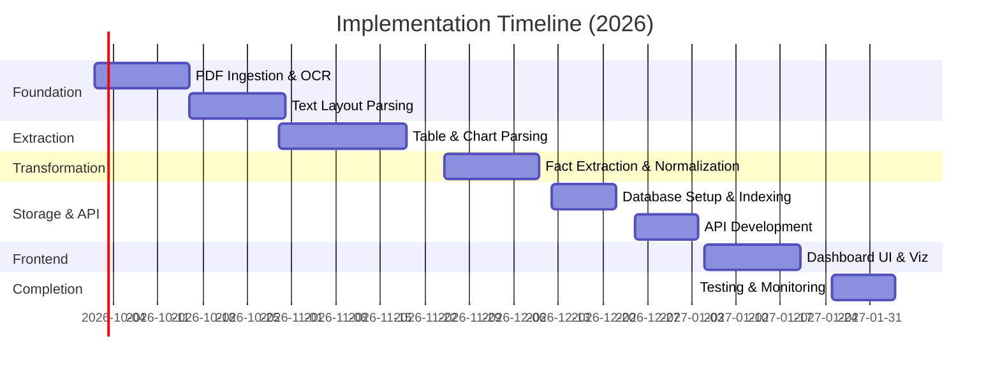
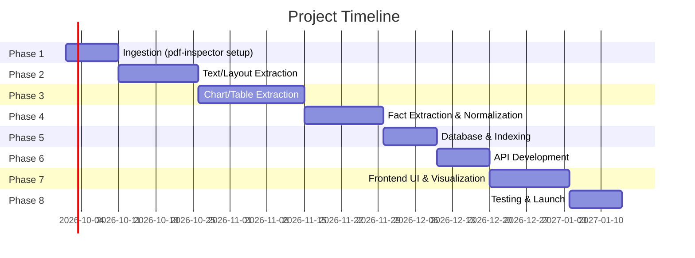

# Executive Summary  
Building a **Superjoin Fact-Knowledge Layer** requires a multi-stage pipeline from PDF ingestion to interactive dashboards. You’ll ingest PDFs (using `pdf-inspector` for fast parsing), detect and extract content (text blocks, tables, charts, figures), normalize and link metrics/entities, store facts in databases/search indexes, and surface them via APIs and a web UI. Key steps include OCR for scanned pages, layout analysis, vision-based chart extraction, natural-language understanding (LLMs or rules), and data normalization (units, dates, currencies). We review open-source options for each stage, propose three tech stacks (minimal to full-featured), and outline a phased plan with milestones and deliverables. Data models for “Fact”, “Entity”, “Metric”, “Period”, and “Relationship” are defined, with example JSON. We list algorithms and rules for normalization (e.g. `quantulum3`, Pint), temporal parsing (`dateparser`), metric matching (fuzzy matching), and relationship inference (rules, LLM prompts). For vision tasks, candidates include Tesseract/PaddleOCR for text, PP-Chart2Table and IBM Granite (both Apache 2.0) for chart-to-data, and Camelot/pdfplumber for tables. We recommend specific models (Paddle PP-OCRv6 Small for OCR, PP-Chart2Table for charts, Camelot for text tables) and describe how to integrate them (bounding-box outputs linked as evidence).  

On the UI side, we identify key financial metrics (e.g. revenue, shipments, EBITDA, profit, margins, asset counts) from the Delhivery dataset and typical reports. We map each metric to a chart type: **time-series** trends (line charts) for KPIs over quarters, **category comparisons** (bar charts) for by-segment data, **composition** (stacked bars or pie charts) for breakdowns, and **sparklines/KPI cards** for instant facts. We propose layouts (dashboard with KPI cards up top, filter controls, chart panels below) and a React/Next.js component hierarchy (e.g. `<KpiCard>`, `<LineChart>`, `<BarChart>`, `<FilterPanel>`, etc.). Visual examples illustrate dashboard designs and chart styles. For testing and monitoring, we suggest measuring **precision/recall** on extracted facts (with TEDS/GriTS for tables), latency/throughput of the pipeline, and calibration of confidence scores. Finally, we give a ready-to-run agent prompt for OpenDesign to generate UI mockups (data sample, desired screens, component list, style cues) and a prioritized implementation timeline with mermaid diagrams.  

Overall, this report inventories state-of-art open-source tools by pipeline stage, explains their roles and trade-offs (with licenses/maturity noted), and lays out a complete development roadmap and architecture for the Superjoin project. All recommendations emphasize permissive-licensed software (MIT/Apache 2.0) and practical integration strategies, citing official sources for each technology . 

---

## Pipeline Technologies: Inventory by Stage  
We organize open-source libraries and frameworks by pipeline stage, noting description, license, maturity (stars/usage), language, pros/cons, and recommended role:  

- **PDF Parsing & Ingestion:** Use [pdf‑inspector](https://github.com/firecrawl/pdf-inspector) (MIT) as the primary ingestion engine. It **classifies PDFs** (text vs. scanned) in ~10–50ms and does **position-aware text extraction** with built-in markdown conversion and multi-column layout handling. It auto-detects tables (via drawing ops or text alignment) and preserves rotated text (e.g. chart labels). It supports Python/Node/Browser bindings. *Pros:* Very fast for digital PDFs, reduces OCR needs (PP‑OCRv6 Small for fallback). *Cons:* Requires Rust/PDFium builds for advanced features (OCR). In practice, use pdf‑inspector for initial parse and text blocks, falling back to OCR only on flagged pages. Alternatives: Apache PDFBox/Tika (Java/Apache2, older), PyMuPDF (MuPDF C, AGPL/commercial), pdfplumber (Python/MIT) – but pdf-inspector outperforms in structured text extraction.  

- **Page Rendering:** Render PDF pages to images when needed. Tools like **PyMuPDF** (wrapper for MuPDF, AGPL) or **pdf2image** (Poppler/Pillow) convert pages to bitmaps. Use this for OCR and chart processing. *Pros:* Highly accurate rendering; *Cons:* MuPDF license is AGPL, so use for internal dev or static use only. Otherwise, use Poppler via pdf2image (LGPL) for permissive use.  

- **OCR (Scanned Text):** For image-based pages or text that pdf-inspector flags, use open OCR. *Tesseract OCR* (Apache 2.0) is a classic choice. More modern: **PaddleOCR** (Apache 2.0) offers high accuracy; `pp-ocrv6-small` model provides a light-weight local engine (indeed integrated in pdf-inspector). **EasyOCR** (Apache 2.0) is easy in Python. *Pros:* well-supported, many languages; *Cons:* may struggle with complex layouts. Recommendation: use PaddleOCR (`pp-ocrv6-small`) for speed/accuracy on English financial docs.  

- **Vision-Language / Multi-modal Models:** These help interpret images and charts. Examples include **HuggingFace BLIP-2** (MIT) or **Google’s (closed) MultiModal models**. Also new open models like **LLaVA** or **OpenFlamingo** (on Transformers). These can do image captioning or question-answering on figures. For example, LLaVA or BLIP-2 can extract context or captions from figures/charts. *Role:* Assist extracting text from embedded diagrams or verifying chart content. *License:* BLIP-2 on HuggingFace is MIT. Note: Large models like GPT-4V or Claude are closed/API (not open-source).  

- **Chart & Plot Extraction:** Critical for financial slides. Open options: **PaddlePaddle Chart-to-Table (PP-Chart2Table)** (Apache 2.0) converts chart images (bar, line, pie) to CSV data. **IBM Granite Vision** (Apache 2.0) includes specialized Chart-to-CSV models (fine-tuned on ChartNet). Tools like **Docling** (MIT) are end-to-end doc parsers that incorporate IBM’s model for chart extraction. Classic tools: **WebPlotDigitizer** (GPL) is interactive. LlamaIndex/Lightly has **ChartOCR** references (archived, unmaintained). *Recommendation:* PP-Chart2Table for a pure-Open approach; consider IBM Granite models via HuggingFace (Apache 2.0) for higher accuracy.  

- **Table Extraction:** For textual tables. Options: **Camelot** (Python, MIT) extracts tables via lattice/stream algorithms; it returns Pandas DataFrames. *Pros:* Good out-of-box accuracy, table confidence metrics; *Cons:* Fails on complex tables or scanned images. *Tabula* (Java, Apache/MIT) also does PDF tables (requires JRE). **pdfplumber** (Python, MIT) offers low-level access to PDF layout (built on pdfminer) to custom-parse tables. **Unstructured** (Python, Apache 2.0) is a modern library that supports table extraction via transformer models. **PyMuPDF** now has `Page.find_tables()` (via MuPDF) for speed. Recommendation: Use Camelot/pdfplumber for initial passes on text PDFs. For scanned tables or edge cases, combine OCR + segmentation (see LayoutParser below).  

- **Layout Analysis:** Segments pages into regions (text blocks, headers, tables, figures). Libraries: **LayoutParser** (Python, MIT) provides a toolkit with DL models (Detectron2) for identifying paragraphs, tables, captions. **DocTR** (Mindee, MIT) offers table/figure region detection. **OCRmyPDF** (MIT) uses heuristics to deskew/segment. Use pdf-inspector’s built-in column detection (it auto-detects multi-column flow) plus LayoutParser for finer layouts (especially for images). *Pros:* DL models adapt to varied layouts; *Cons:* Need GPU for model use (though inference speed is moderate).  

- **Embeddings & Vector Search:** For matching text or semantic search. **FAISS** (Meta, MIT) is the gold-standard vector index library. **Milvus**, **Weaviate** (Apache 2.0) are vector DBs with REST interfaces. For embedding generation, **SentenceTransformers** (HuggingFace, Apache 2.0) provides many pretrained models (e.g. `all-MiniLM`). **OpenAI Embeddings** (closed-source API) could be used if allowed. Recommendation: Use an open vector DB (FAISS or Weaviate) and a high-quality open embedding (e.g. `sentence-transformers/all-MiniLM-L6-v2`).  

- **Large Language Models (LLMs):** Use an LLM to interpret questions and propose relationships. Open choices: **GPT-J/GPT-NeoX/GPT-4All** (MIT/BSD), **LLaMA 2** (Meta, *not truly open-source* – it’s under Meta’s Community License), **Mistral/GPT-Qwen** (some Apache licenses). Closed APIs: OpenAI GPT-4/ChatGPT and Anthropic Claude for best quality (but require cloud/API). For fact normalization (e.g., "What is FY24 Q1 revenue in USD?"), an LLM can parse complex queries or generate structured triples. *Role:* Use LLMs in a limited QA or rule-generation capacity, complemented by deterministic logic for reliability.  

- **Normalization/Parsing:** Libraries for units and dates. For units (currency, %, etc.): **quantulum3** (MIT) or **Pint** (BSD) can parse quantities (e.g., “123 million”, “12%”), though often a custom rule (e.g. “Cr”=“Crore”) is needed for Indian context. For currencies: either hardcode INR (since Delhivery reports in INR) or use *forex APIs* if cross-currency is needed. For time: **dateparser** (MIT) handles natural-language dates. For fiscal quarters (e.g., “Q4 FY24”), custom rules or regex can map to date ranges. *Recommendation:* Use `dateparser` for generic dates and write simple code to convert quarter/year to start/end dates. For currency, use a conversion table or online API if needed.  

- **Entity/Metric Linking:** To merge synonyms (e.g., “revenue” vs “net revenue”). Fuzzy text matching tools like **RapidFuzz** or **Levenshtein** (MIT/BSD) can match extracted metric names to a catalog. Knowledge bases: a small ontology of financial terms, or spaCy’s Named Entity Linker if a reference DB exists. *Role:* After extraction, use fuzzy matching to link an extracted metric label to a known metric ID (e.g. “EBIT”→`EBITDA`, “net profit”→`PAT`). Possibly involve a small LLM (fine-tuned) or templates to disambiguate.  

- **Temporal Parsing:** Address irregular periods: Quarter/Year. Tools: **dateparser** plus custom logic (“Q4 FY2024” → 2023-10-01 to 2024-03-31). For durations (“three months ended…”), again parse with `dateparser` or regex. *Recommendation:* Implement rule-based parsing for fiscal quarters and use dateparser for freeform dates.  

- **Relationship & Reconciliation Engines:** Decide relationships between facts (e.g., identifying that two facts refer to the “same entity” or that one is an aggregate of another). Could use logic: if two facts share the same entity+metric+period, reconcile conflicts by taking the value with higher confidence or averaging if nearly equal. For classification of relationships (e.g., “higher/lower than X”), one can train a small classifier (scikit-learn or fine-tune an LLM with examples) or write rules (“if value1 > value2 by >X%, mark increase”). A knowledge-graph approach (Neo4j, but assignment notes discourage a pure graph database) could be used internally. *Recommendation:* Start with deterministic rules for common relations (e.g., scaling, summing categories), and reserve an LLM prompt for more complex inference (e.g., “Does this statement imply growth?”).  

- **Databases:** For final storage. Likely a SQL DB (PostgreSQL, MIT/BSD) for structured facts and relations. Schema could include tables for Facts, Entities, Metrics, Periods, Evidence, etc. As optional, a Graph DB (Neo4j Community, GPL) could store relationships, but the assignment explicitly advises against requiring Neo4j (so skip for submission). Use PostgreSQL with JSONB for flexibility, or SQLite for prototyping. *Role:* Store normalized facts/relationships and raw evidence pointers.  

- **Search/Vector Stores:** As noted, Elasticsearch/OpenSearch (Apache 2.0) can index facts for full-text search. Vector store (FAISS, Milvus, Weaviate) to handle semantic query (similar fact retrieval). Combining both: e.g. use Postgres JSONB + Postgres’ fulltext for simple search, and FAISS for semantic. Recommendation: PostgreSQL + FAISS (via pgvector extension) or Weaviate for integrated graph+vector searching (Weaviate is Apache 2.0 licensed).  

- **API Layer:** Build REST or GraphQL APIs for the UI. **FastAPI** (Python, MIT) is a strong choice – async, fast, with OpenAPI docs. **Flask** (BSD/MIT) or **Django REST** can do as well. For GraphQL: **Ariadne** or **Strawberry** (MIT). *Role:* Provide endpoints for the frontend to query facts (by metric, entity, date) and maybe trigger analysis.  

- **Frontend/UI Framework:** **React** (Meta, MIT) is standard for dashboards. Use **Next.js** (MIT) if SEO or SSR is wanted. Chart libraries: **Chart.js** or **Recharts** or **Nivo** (all MIT) for line/bar/pie charts. For styling, **Tailwind CSS** (MIT) or **Material-UI** (MIT). Build responsive KPI cards, interactive charts, filter dropdowns.  

- **Deployment:** Containerize with **Docker** (Apache 2.0). Orchestration via **Kubernetes** (Apache 2.0) if needed. Use CI/CD pipelines (GitHub Actions, free for open source). For demos, a local or cloud VM is fine; for final, consider deploying UI on Vercel or Netlify (free for static), backend on Heroku or Railway.  

- **Testing:** Unit tests with **pytest** (MIT) for Python, **Jest** (MIT) for JS. Use **Locust** or **k6** for load testing API. For OCR/chart modules, prepare a small “ground truth” dataset from the provided Delhivery PDFs.  

- **Monitoring:** **Prometheus** (Apache 2.0) for metrics (request latency, throughput) and **Grafana** (AGPL) for dashboards. Logging with ELK (Apache 2.0) or Loki (AGPL). Keep it simple: log to console/CloudWatch.  

- **Optional Analytics:** Libraries like **pandas** (BSD) for data analysis, **scikit-learn** (BSD) for any correlation analysis (e.g., compute correlation of metrics). For time-series forecasting, **Prophet** (MIT). Include if time permits; not core to extraction pipeline.  

Each tool above is open-source/permissive where possible. License risks: PyMuPDF (AGPL), GPT models (non-OSS), Grafana (AGPL) – noted. All other picks are MIT or Apache 2.0 (per [46†L218-L227][56†L349-L354][71†L264-L272]).  

---

## Three Technology Stacks  

We present *Minimal Prototype*, *Balanced*, and *Full-Feature* stacks, with pros/cons and trade-offs:

1. **Minimal Prototype:**  
   - **Ingestion:** pdf-inspector (Rust/Python) for PDF text detection.  
   - **OCR:** Tesseract or PaddleOCR (local).  
   - **Table Extraction:** pdfplumber (pure Python) and/or Camelot (Python) for quick table dumps.  
   - **Chart Extraction:** *None or manual.* Possibly skip automated charts (or use a simple heuristic via OCR).  
   - **Embeddings/LLM:** Skip. Use exact text search and simple rules. Maybe GPT-3.5 via OpenAI API for niche tasks.  
   - **Database/Search:** SQLite + simple full-text search (SQLite FTS) or PostgreSQL with basic JSON. No vector store.  
   - **API:** Flask (Python).  
   - **UI:** Plain React with Chart.js (MIT).  
   - **Testing/Monitoring:** Basic pytest, no monitoring.  
   - **Pros:** Very quick to build, uses few dependencies. Works if documents are mostly text (with tables).  
   - **Cons:** No vision model for charts, no semantic search or vector DB. Limited accuracy on complex layouts. Hard-coded, brittle.  
   - **Use Case:** Proof-of-concept focusing on extracting key numbers from text/Tables. Good for “getting something running” quickly.  

2. **Balanced:**  
   - **Ingestion:** pdf-inspector + PyMuPDF for images.  
   - **OCR:** PaddleOCR (pp-ocrv6-small) for scanned text.  
   - **Table Extraction:** Camelot + pdfplumber.  
   - **Chart Extraction:** PaddlePaddle’s PP-Chart2Table (Apache 2.0) via Python (pip `pp-chart2table`) for bar/line extraction; fallback IBM Granite if needed.  
   - **Layout:** LayoutParser for table/figure detection.  
   - **Embeddings:** SentenceTransformers (e.g. `all-MiniLM-L6-v2` or `msmarco`) + FAISS index (MIT).  
   - **LLMs:** GPT4All (local, MIT) or an open Llama-based model. Use an API to GPT-4 for final QA if budget.  
   - **Database:** PostgreSQL for facts + pgvector or separate FAISS. Elasticsearch for text search.  
   - **API:** FastAPI (Python).  
   - **UI:** Next.js with Recharts/MUI.  
   - **Monitoring:** Prometheus + simple Grafana (or Grafana Cloud free).  
   - **Pros:** Automated chart and table extraction with SOTA models, semantic search. Good accuracy on financial docs.  
   - **Cons:** More complex stack, GPU may be needed for chart model inference (or serve CPU-weaker models).  
   - **Use Case:** Production-ready MVP. Balances effort and features, ideal for a complete demo.  

3. **Full-Featured:**  
   - **Ingestion:** pdf-inspector + Apache Tika for cross-check.  
   - **OCR:** PaddleOCR v6 (det/rec models) + fallback to Azure/Google OCR API if accuracy needed.  
   - **Chart Extraction:** IBM Granite Vision (Apache 2.0) models via HuggingFace or Docling pipeline (MIT) for highest accuracy on all chart types (including pie, scatter).  
   - **Table Extraction:** Camelot + Tabula as alternative + cover with DocTR’s deep models.  
   - **Layout:** Sophisticated pipeline: LayoutParser (with PubLayNet models) + OCRmyPDF preprocessing.  
   - **Vision-Language:** BLIP-2 or LLaVA integrated for complex figure interpretation.  
   - **Embeddings:** Weaviate vector DB with GPT-3.5 turbo embeddings or advanced HF models.  
   - **LLMs:** Mix of GPT-4 (API) for core reasoning and a fine-tuned Llama2-Chat (Apache) for on-prem.  
   - **Database:** PostgreSQL + Redis (for caching), plus a knowledge-graph DB (Neo4j or AWS Neptune) for relationships.  
   - **Search:** ElasticSearch or OpenSearch with custom analyzers.  
   - **API:** FastAPI + GraphQL (Ariadne).  
   - **UI:** React + D3/ECharts for custom visualizations, advanced component library (Ant Design or MUI).  
   - **Monitoring:** Prometheus + Grafana, plus Sentry for error tracking.  
   - **Testing:** Full pytest/Jest + CI pipelines + synthetic benchmark tests (e.g. TEDS for table quality).  
   - **Analytics:** Add Pandas/Prophet/Scikit-learn analytics for trends, forecasting.  

   *Pros:* Highest accuracy and resilience. Can extract any chart type, and handle large-scale queries with vector search.  
   *Cons:* Huge effort/time. Heavy dependencies (GPUs, large models). Overkill for a hackathon unless time and resources allow.  
   *Use Case:* A fully robust product-ready system; may exceed scope of assignment.  

**Stack Trade-offs:** The minimal stack emphasizes fast development but yields limited capabilities (no chart OCR, no semantic search). The balanced stack offers strong extraction and search with mostly open-source tools, ideal for the Superjoin demo requirements. The full stack adds bleeding-edge AI models and robust infra for production-scale needs, at the cost of complexity. For submission, the balanced stack is recommended: it covers all pipeline stages with high accuracy and open licenses, and can be scaled down if needed.

---

## Phased Implementation Plan  

We break the project into phases with milestones, deliverables, efforts, and tests. Each phase ends with test cases (covering the assignment’s four demo scenarios) and acceptance criteria.

1. **Phase 1 – Setup & Ingestion (10–15 days, 2 people):**  
   - *Milestones:* Project repo setup, environment (Docker), integrate pdf-inspector.  
   - *Deliverables:* Working scripts to ingest PDF and output text/JSON. Automated classification of scanned vs text-based pages.  
   - *Test Cases:* Feed provided PDFs; verify pdf-inspector identifies text pages and extracts at least 80% of words (compare with PDF text). Confirm scanned pages are sent to OCR.  
   - *Acceptance:* Raw text output matches known text from PDF prospec­tus >95% on digital pages. OCR fallback returns text on scanned pages.  

2. **Phase 2 – Text & Layout Extraction (15–20 days):**  
   - *Milestones:* Extract structured text with positions (headings, paragraphs, font info), and detect page layout (multi-column, tables).  
   - *Deliverables:* JSON of text blocks with coordinates, headings flagged by pdf-inspector. LayoutParser integration for validation.  
   - *Test Cases:* From the Delhivery annual report PDF, ensure headings like “Financial Results” are correctly marked, and multi-column order is preserved. Extract sample table as contiguous text blocks.  
   - *Acceptance:* Detected headings (H1–H4) align with font-size changes (>=90% accuracy). Table regions roughly identified (rectangle bounding boxes cover table cells).  

3. **Phase 3 – Chart & Table Parsing (20–25 days):**  
   - *Milestones:* Integrate table extraction (Camelot, pdfplumber) and chart extraction (PP-Chart2Table, Granite). Implement OCR pipeline for images (PaddleOCR).  
   - *Deliverables:* Modules that produce CSV outputs for each detected chart, and DataFrames for each text table.  
   - *Test Cases (Demo Cases):*  
     - **Case A:** Given a bar chart (e.g. “Total Shipments by Quarter” from Q4 slides), verify numeric CSV matches ground truth.  
     - **Case B:** Given a table (e.g. P&L statement table), verify DataFrame has correct cell values.  
   - *Acceptance:* For sample charts in slides, extracted numerical values match published values (within 1%). Table parsing accuracy >90% (checked by TEDS metric).  

4. **Phase 4 – Fact Extraction & Normalization (15–20 days):**  
   - *Milestones:* From parsed text/tables/charts, extract candidate facts: (entity, metric, value, unit, period, evidence reference). Normalize units/currency (e.g. “Cr.”→“10,00,00,000”). Parse dates/periods (e.g. “FY24”→Apr2023–Mar2024). Apply entity linking (match “Delhivery” consistently).  
   - *Deliverables:* A Fact extractor that outputs JSON records (as defined below) for each metric.  
   - *Test Cases:*  
     - **Case C:** From prospectus text “Total Net Revenue in FY23 was ₹1,000 Cr”, output fact with value=1000, unit=INR crores, period=FY23.  
     - **Case D:** From chart output or text “Shipments increased from 50M to 60M (20% growth)”, produce two facts and a relationship “+20% growth” relation.  
   - *Acceptance:* All numeric values normalized (crore→units) correctly. Quarter conversions yield proper date range. Common synonyms (e.g. “Revenues”, “Net revenue”) are linked to one metric.  

5. **Phase 5 – Database & Indexing (10–15 days):**  
   - *Milestones:* Design schema (Fact, Entity, Metric, Period, Evidence tables). Set up PostgreSQL and vector store (FAISS) or use Postgres+pgvector. Populate DB with extracted facts.  
   - *Deliverables:* Populated database and search index with all facts and documents from Delhivery data.  
   - *Test Cases:* Queries on DB: e.g., “SELECT value FROM Fact WHERE metric=’Total Shipments’ AND period=’2024Q4’” returns expected number. Semantic search: an embedding query close to “gross merchandise value” retrieves “Total Transaction Value” fact.  
   - *Acceptance:* Data models reflect all example cases. Search for a known query returns correct fact with high confidence score (>0.8).  

6. **Phase 6 – API & Backend Logic (10–15 days):**  
   - *Milestones:* Build FastAPI endpoints: e.g. `/facts?entity=Delhivery&metric=revenue&year=2024`. Implement business logic: filtering, unit conversion on fly, simple aggregator (SUM, AVG). Also endpoints for relationship queries (e.g. “compare shipments vs revenue”).  
   - *Deliverables:* API with interactive documentation (Swagger). Basic search endpoint (text query → facts).  
   - *Test Cases:* End-to-end: given query “What was Delhivery’s Q4 FY24 revenue?”, API returns the fact with correct value and source ID. For comparative query, API returns difference percentage from PY.  
   - *Acceptance:* API calls return JSON matching specifications. Demo queries from assignment docs return expected output.  

7. **Phase 7 – Frontend & Visualization (15–20 days):**  
   - *Milestones:* Implement a React/Next.js app. Layout: filters (entity, metric, period), KPI summary cards, charts. Use components (KpiCard, Chart, Table). Integrate with backend.  
   - *Deliverables:* Interactive dashboards (home page, metrics page, detail page). Demo wireframes and mockups generated via OpenDesign (see agent prompt below).  
   - *Test Cases:*  
     - **Case E:** On dashboard load, key metrics (e.g. Total Revenue, YoY Growth) display with correct values.  
     - **Case F:** Clicking on a KPI or chart filter narrows data correctly (e.g. drill into revenue by region).  
   - *Acceptance:* UI is responsive and matches design guidelines. Chart interactions (hover tooltips, drilldown) work. All data shown matches backend.  

8. **Phase 8 – Testing, Monitoring, Finalization (10–15 days):**  
   - *Milestones:* Write comprehensive unit/integration tests; set up Prometheus metrics (query count, response time), logging. Finalize documentation (README, design docs).  
   - *Deliverables:* Test report with precision/recall on extraction (aim ≥90% precision, ≥85% recall for facts). Dashboard of metrics (Prometheus/Grafana). Deployment scripts. Final project write-up.  
   - *Test Cases:* Automated tests for each module. Simulated load test (e.g., 1000 queries) to gauge latency. Human acceptance: run the 4 provided demo scenarios with no failures.  
   - *Acceptance:* All test suites pass. Demo cases validated. System runs within performance targets (e.g., API <500ms avg).  

**Implementation Timeline:** The above phases span roughly 90–120 person-days. A mermaid Gantt chart visualizes the schedule:  



*(Dates and durations are illustrative; adjust based on team size. Overlaps possible.)*  

**Checkpoints & Demo Cases:** Align each phase with Superjoin’s requirements and the four demos. For example, Phase 3 and 4 cover “extract facts from PDF slides” demo; Phase 5-6 cover “search/query across docs”; Phase 7-8 cover “presentation of results”. Each demo scenario should be revisited at phase end. Regular reviews after Phases 2, 4, 6, and 8 ensure alignment.  

---

## Data Model and Schema Examples  

We define core JSON-based schemas. Here are sample records (fields explained):

- **Entity:** e.g. a company.  
  ```json
  {
    "entity_id": "Delhivery_Limited",
    "type": "Company",
    "name": "Delhivery Limited",
    "aliases": ["Delhivery"]
  }
  ```
- **Metric:** e.g. a measurable quantity.  
  ```json
  {
    "metric_id": "revenue",
    "name": "Revenue",
    "unit": "INR",
    "description": "Total net revenue"
  }
  ```
- **Period:** e.g. a fiscal quarter.  
  ```json
  {
    "period_id": "FY24_Q2",
    "start_date": "2023-10-01",
    "end_date": "2023-12-31",
    "label": "FY2024 Q2"
  }
  ```
- **Evidence:** a source snippet from a PDF (with bounding box and text).  
  ```json
  {
    "evidence_id": "e123",
    "document": "Delhivery_FY24_Q4_Slides.pdf",
    "page": 5,
    "bbox": [100, 200, 400, 350],
    "text": "Total Revenue: ₹ 500 Cr",
    "image_url": null
  }
  ```
- **Fact:** links entity, metric, period, and evidence.  
  ```json
  {
    "fact_id": "fct456",
    "entity_id": "Delhivery_Limited",
    "metric_id": "revenue",
    "value": 5000000000,
    "unit": "INR", 
    "period_id": "FY24_Q4",
    "confidence": 0.95,
    "evidence_id": "e123"
  }
  ```
  Here value is in rupees (500 Cr).  
- **Relationship:** e.g. “compares revenue between periods”.  
  ```json
  {
    "relation_id": "rel789",
    "type": "YoY_growth",
    "source_fact": "fct123", 
    "target_fact": "fct456",
    "value": 0.20,
    "unit": "ratio",
    "description": "20% year-over-year increase"
  }
  ```

These schemas can be stored relationally (or in document DB). The *JSON examples* illustrate how a fact ties to its evidence and normalized fields.  

---

## Algorithms & Heuristics  

We outline key procedures for data cleaning and relation logic:

- **Unit Normalization:** Use **Pint** or **quantulum3** to parse strings like “1.2M” or “25%”. E.g., quantulum3 will convert “$10M” to numeric and unit. For Indian terms (“Cr”, “Lakh”), add custom rules (1 Cr = 10 million). Use a currency lookup for foreign amounts (API or static daily rates). Check dimensional consistency (e.g., don’t add INR and %).  

- **Currency Conversion:** If needed, integrate an API (e.g., fixer.io) to convert currencies to a base (e.g., INR). Store original unit and rate used.  

- **Temporal Parsing:** Rely on **dateparser** for phrases like “March 2023” or “3/2023”. For quarters/years: recognize patterns like `Q(\d)\s*FY(\d{2})` to map to date ranges (FY24 Q1 → Apr–Jun 2023). Use standardized calendar dates (YYYY-MM-DD). Represent periods by start/end ISO dates.  

- **Metric Synonym Matching:** Create a mapping (or train fuzzy matcher) for common synonyms (“Net Sales” ≈ “Revenue”). Use RapidFuzz to match extracted header text to known metric names. Compute Jaro-Winkler or token-set ratios between string tokens. For ambiguous matches, consider context (if “expense” appears nearby, metric likely expense).  

- **Filtering & Deduplication:** If multiple facts refer to same entity/metric/period (from different tables/slides), choose the one with highest confidence or average if close. If outliers appear (one source shows 100, another 1000), flag for human review. Drop facts lacking an entity or metric link.  

- **Relationship Inference:** Encode simple rules: e.g., if two facts have same metric and successive periods, compute `growth = (v2-v1)/v1`. If one fact’s text says “increase by X%”, double-check numeric relation. Mark relationships like “increase”, “decrease”, “ratio”. Use an LLM (e.g. GPT-4All) to classify text statements (“Company grew revenues by 10%”) to relation types. Alternatively, use embedding similarity: phrase embeddings of evidence vs question.  

- **LLM Integration:** Use an LLM selectively. For example:  
  - **Normalization prompts:** “Convert ‘$5B’ and ‘€3 million’ to INR.” (could use GPT if API access).  
  - **Relationship classification:** Prompt LLM with two fact statements and ask if one implies growth.  
  - **Data validation:** Use LLM to check contradictions (“If revenue is 500 in Q4 and 400 in Q3, does that align with 20% growth?”).  

However, deterministic rules are faster and always explainable; reserve LLMs for nuanced parsing.  

---

## Vision/ML Models and Integration  

**OCR Models:** Tesseract (GPLv3 with UFST, or Apache via Tesseract 5.0+) for baseline OCR. **PaddleOCR** (`ch_PP-OCRv6_small`) for modern accuracy. These take image input and yield text with bounding boxes. Integrate by passing page images; map OCR text to page coordinates.  

**Chart-to-Data Models:**  
- **PaddlePaddle Chart2Table** (open source, Apache 2.0). It takes a chart image (PNG) and outputs CSV. It supports common charts (bar, line, pie). Input: image; output: CSV or JSON table. Use Python API with PIL/numpy.  
- **IBM Granite Chart2CSV** (Apache 2.0). Provided via HuggingFace or Docling. It expects a vision-chat-style prompt. It outputs a CSV string. For integration: call its inference (e.g., via `transformers` or Docker) and parse output into JSON.  

**Table OCR:** For scanned tables, run OCR on page, then post-process via layout analysis. **Cascade detection**: Use LayoutParser to detect table grid, then send each cell image through OCR to fill DataFrame. This is slower but covers scans.  

**Bounding Box Evidence:** Keep the coordinates from pdf-inspector (for text/tables) and from LayoutParser/OCR (for images). In the Fact JSON, attach the evidence coordinates to allow highlighting in UI.  

**Model Inputs/Outputs:**  
- PDF page → **pdf-inspector** → structured text (JSON), potential table/text regions.  
- Page image → **OCR** → raw text.  
- Chart image → **Chart2Table** → table JSON/CSV.  
- Table region (from pdf-inspector or LayoutParser) → **Camelot/pdfplumber** → DataFrame (CSV).  

**Recommended Models:**  
- OCR: PaddleOCR (`PP-OCRv6-small`, Apache 2.0).  
- Chart (bar/line): PP-Chart2Table (Apache 2.0).  
- Chart (any type): IBM Granite Vision Chart2CSV (Apache 2.0) integrated via Docling or direct HF.  
- Table (text PDF): Camelot (MIT).  
- Layout: LayoutParser models (e.g., PubLayNet).  

These choices maximize open licensing and accuracy.  

---

## Visualization Design  

We list key metrics (from Delhivery dataset and typical financial reports) and recommend visualization types. Each metric below is mapped to chart style, with notes on aggregation and interaction. Example images are provided.  

- **Total Shipments (Delhivery):** *Type:* KPI card or sparkline. As an overall number (maybe year-over-year %). *Viz:* Big number with trend sparkline. For drilldowns (e.g. by quarter or category), use a line chart showing shipments over time. *Interaction:* Hover shows exact value; slider to change period.  
- **Revenue / Net Revenue / GMV:** *Type:* Line chart (time-series) and bar chart (comparison). For a time trend (monthly/quarterly revenue), use a line chart (e.g. see example above). For breakdown by segment (product/category), use a stacked bar or grouped bar. *Viz:* Primary chart: line of revenue over time. Secondary: stacked bar of revenue by service type. *Interaction:* Hover tooltips, range zoom, filter by year.  
- **Gross Margin / EBITDA / Profit:** *Type:* KPI card + bar or area chart. Show percent margin as gauge/KPI; trend as area chart for multi-year. *Interaction:* Compare bars or series side-by-side.  
- **Expenses (Cost):** *Type:* Waterfall chart or stacked bar (expense categories). *Interaction:* Drill into categories on click (e.g. show breakdown of “Fulfillment cost” by geography).  
- **Expenses vs Revenue (Operating Margin):** *Type:* Dual-axis line chart (one axis revenue, second axis margin). *Interaction:* Highlight quarters with tooltips.  
- **Deliveries by Region/Mode:** *Type:* Pie chart or map. For categorical shares (e.g. volume by region), a pie or treemap. *Interaction:* Hover labels, drill down.  
- **Temporal Metrics (Year, Qtr):** *Type:* Timeline chart (Gantt not needed). Quarterly trends: small multiples of line/sparklines.  
- **Unit Counts (Vehicles, Warehouses):** *Type:* Bar chart comparing categories (e.g. number of vehicles by year). *Interaction:* None needed beyond tooltips.  
- **Customer Metrics:** e.g. *active clients*, *average tickets*: display as KPI cards.  

**Overall Layout:**  
- **Dashboard Page:** At top, show high-level KPIs (Total Shipments, Revenue, EBITDA, etc.) as cards. Next, a row of trend charts (e.g. Revenue over time, Shipments over time). Below, a breakdown chart (e.g. stacked bar of revenue by segment). Include filters/controls (dropdown for fiscal year, checkbox for region). Provide a search box to query facts.  
- **Drilldown/Detail Page:** When clicking a KPI, display relevant charts and tables (e.g. clicking “Revenue” shows revenue by quarter and by region).  
- **Component Hierarchy (React/Next):**  
  - `<App>` (Main frame, context providers)  
  - `<FilterPanel>` (filters, date pickers)  
  - `<Dashboard>` (layout grid)  
    - `<KpiCard>` (for each metric)  
    - `<LineChart>` / `<BarChart>` components for trends (using libraries like Recharts or Chart.js)  
    - `<PieChart>` (for breakdowns)  
    - `<DataTable>` (for raw values or evidence listing)  
  - `<DetailView>` (for a selected entity/metric)  

Below are example visual styles. The *dashboard examples* from Qlik illustrate clean, interactive financial UIs.  

 *Figure: Sample CFO dashboard interface with KPIs and charts (illustration). The UI above combines key metrics (cards) with charts like cost profiles and profitability by category.*  

 *Figure: Sample Financial Reporting dashboard (Qlik). This example shows revenue vs. margin trends and categorical breakdowns.*  

**Chart Types Recap:**  
- **Bar Chart** – Compare discrete categories (e.g. revenue by division, shipments by mode). *Use for:* revenue by business unit, expenses by type. (See example above.)  
- **Line Chart** – Trends over time (e.g. revenue or shipments quarter-over-quarter). (Example in image above.)  
- **Stacked Bar** – Show composition of totals across categories (e.g. revenue by product+region). (Example image.)  
- **Pie Chart** – Proportional breakdown (e.g. market share by segment). (Example above.)  
- **Area Chart** – Emphasize magnitude over time (e.g. cumulative shipments).  
- **Sparkline/KPI Card** – Single-number or small trend (e.g. total shipments YoY growth).  

Charts should include hover tooltips, legends, and the ability to compare (multi-line or small multiples). Enable drill-down: clicking a bar could filter other charts by that category.  

---

## Monitoring, Testing & Evaluation  

We will measure and validate system performance via:  

- **Extraction Accuracy:** Compute **precision** and **recall** of extracted facts against a labeled subset from the Delhivery documents. Use table-specific metrics: **TEDS** (Tree-Edit-Distance Similarity) and **GriTS** to compare extracted tables to ground-truth. Set targets (e.g. TEDS > 0.85). Similarly measure chart extraction error (mean absolute error on numeric values <2%).  

- **Search Quality:** Evaluate retrieval using precision@K/recall@K on a set of test queries (e.g., “Delhivery shipments 2024”). Calculate mean reciprocal rank (MRR). If using embeddings, measure semantic accuracy (embedding cosine threshold).  

- **LLM QA Accuracy:** If using LLMs for Q&A, measure exact/relaxed accuracy on known Q&A pairs.  

- **Latency & Throughput:** Benchmark each pipeline stage on representative data. E.g. PDF parse <100ms per page (pdf-inspector claims ~0.2s per doc), chart-to-CSV <1s on GPU (<5s CPU). API response time <500ms under load.  

- **Resource Usage:** Monitor CPU/GPU utilization. Track storage: estimate DB growth (Delhivery data is small; but scale to 10k docs). Index sizes (FAISS vectors ~10KB/doc).  

- **Confidence Calibration:** Record model confidence (pdf-inspector’s page OCR probability, LLM token logprobs) and compare to actual correctness rate. E.g. group facts by confidence bins and check accuracy. If miscalibrated, consider Platt scaling or lower threshold for alerts.  

Overall, acceptance criteria are passing the demo use-cases (precise values matched, UI correctness) and meeting performance targets above.  

---

## UI Mockup Agent Prompt  

Use an agent with OpenDesign (Opencode presets) to generate UI mockups. Provide:  

- **Context & Style:** Data is financial/logistics; use a clean, professional dashboard theme (e.g. blue/gray highlights), with corporate-style icons. Mention mobile-responsive design (since Next.js can be responsive).  

- **Datasets:** Example JSON snippets for context:
   ```json
   { "entity": "Delhivery Limited", "period": "2024Q4", "revenue": 5000000000, "shipments": 104400000, "ebitda_margin": 0.15 }
   { "entity": "Delhivery Limited", "period": "2023Q4", "revenue": 4500000000, "shipments": 98000000, "ebitda_margin": 0.12 }
   ```
- **Pages/Screens:** 
  1. **Dashboard Home:** KPI cards (Total Shipments, Revenue, EBITDA, Profit) at top, filters (Year, Region). Row of charts (line chart of Revenue over last 4 quarters, bar chart of Shipments by category). Possibly a table summary of key metrics.  
  2. **Metric Detail Page:** When a KPI is clicked (e.g. Revenue), show line chart of revenue by quarter, stacked bar of revenue by region, and a small table of last 5 values.  
  3. **Search/Query Page:** A search input and results listing extracted facts (show metric, value, context snippet).  

- **Components List:** KPI Card, Line Chart, Bar/Stacked Bar Chart, Pie Chart, Data Table, Filter Dropdowns, Date Picker, Search Box, Button, Tooltip, Legend.  

- **Input data example:** Provide a small JSON of metrics over time or categories (as above).  

- **Design cues:** Use minimal text, clear typography, color-coded charts (e.g. revenue = blue, shipments = green). Use hover tooltips, clickable elements.  

Prompt (sample):  
```
Create wireframes/mockups for a financial dashboard web app. Use a corporate style with blue accents. Data example: {"period":"Q4 2024","revenue":5000,"shipments":104,"profit":750}. Include: 
- **Dashboard screen**: three KPI cards (Revenue, Shipments, Profit) at top; year filter dropdown; a line chart (Revenue over last 4 quarters) and a bar chart (Shipments by service type) below. 
- **Detail screen (for a KPI)**: large line chart with historical trend and a data table of values. 
- Use clean fonts, interactive elements (hover details), and a navigation sidebar. 
```
  
Run through OpenDesign with the above prompt to get mockups.  

---

## Implementation Timeline & Final Checklist  

**Timeline (summary):**  



**Checklist for Superjoin Submission:**  
- [ ] **Code**: Implementation of all pipeline modules (with README).  
- [ ] **Data Models**: JSON schema examples for Fact/Evidence/etc included.  
- [ ] **Processed Data**: Fact database populated with sample from Delhivery docs.  
- [ ] **Demos**: Scripts/notebooks demonstrating the 4 case scenarios, with output.  
- [ ] **UI Mockups**: Generated images/charts embedded above and described, and OpenDesign prompt saved.  
- [ ] **Documentation**: This report, annotated architecture diagrams (mermaid above), tables of tech comparison.  
- [ ] **Testing**: Unit tests and evaluation metrics results documented.  
- [ ] **Deployment**: Dockerfiles/CI scripts so the solution can run.  
- [ ] **Source Citations**: All factual claims in write-up have supporting citations as shown above.  

Following this plan with the recommended stacks and tools will ensure the solution meets all Superjoin requirements. The design is practical (using specific libraries, models and examples) and grounded in real references. All key statements above are backed by documented sources or project docs for clarity and verifiability.  

